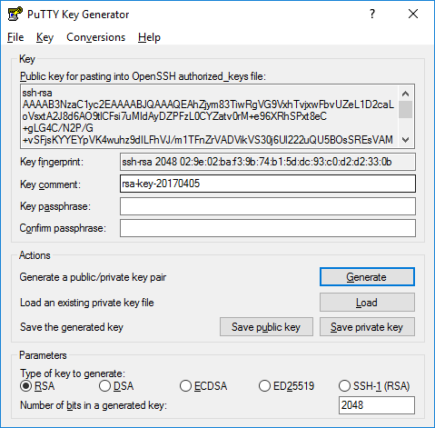

# SSH
[What is SSH](https://www.ssh.com/ssh/protocol/)

SSH is used to connect to remote hosts. After you made sure you have connectivity to a machine (intranet, internet, or VPN) you can remotely connect to different servers.  

Old way, telnet is the unencrypted remote access utility now mostly used to troubleshoot connectivity. Read more under [networking section](./network.md).  
Modern way, SSH (Secure Shell) is an encrypted protocol to remotely access your machine, and uses port 22.  

## SSH Keys

SSH requires _private_ and _public_ keys in order to connect remotely to machines. Public keys will be located on the destination hosts, while the private keys will kept to the machine requesting the remote access.  

Local Computer [private key] -> Remote Host [public key]  

### Generating SSH Keys
You need to generate SSH keys in order to connect remotely using ssh. 
```shell
# Generate the private and corresponding public key
# ssh-keygen -q -t <encrypt type> -f <location & name> -C <comment> -N <passphrase>
$ ssh-keygen -q -t rsa -f ~/.ssh/id_rsa -C '' -N ''

> id_rsa        # private key
> id_rsa.pub    # public key
```
* Omitting the -N ‘’ will prompt for password which would be necessary when you access system.

Then you need to add your **public** key to the remote hosts. __Never share your private keys since that is your identification!!__  

### Using Putty
Putty has different types of ssh key types. It also has ways to convert keys to __OpenSSH__ if needed.  
   

Creating a public and private keys using putty gen:  
[Tutorial Here](https://www.ssh.com/ssh/putty/windows/puttygen)
1. Open Putty Generator 
2. Choose RSA key type, and bits to generate: 2048
3. Once generated click on 'Save public key' and 'Save private key'. This will save RSA ssh keys.  
    1. Private key will be in .ppk format that is used with Putty to connect. 

If you require OpenSSH type keys:  
[Tutorial Here](https://www.simplified.guide/putty/convert-ppk-to-ssh-key)
1. **Public Key:** copy inside the _'Public key for pasting into OpenSSH authorized_keys file'_ . Open notepad and paste. Save with a __.pub__ extension.  
2. **Private Key:** Click on _'Conversions'_ then click on _'Export OpenSSH key'_, save file with no extension. 
```bash
> opensshkey_public.pub
> opensshkey_private
```

Convert OpenSSH to ppk file for Putty connections:  
[Tutorial Here](https://docs.oracle.com/en/cloud/paas/goldengate-cloud/tutorial-change-private-key-format/)
1. Open Putty Generator
2. Click Load and load the private key. Have the finder show all files in needed. 
3. Click on 'Save private key' and save as a .ppk file. 


If using the cloud you can add your public key on creation in order to access initially.  
To add more public keys to remote hosts, apend them to the authorized keys file.  
```shell
$ cd ~/.ssh/authorized_keys
$ cat id_rsa.client >> authorized_keys 

# Quickly copy your ssh keys
$ pbcopy < ~/.ssh/id_rsa.pub
$ cat ~/.ssh/id_rsa.pub | pbcopy
```

### SSH key permissions

SSH keys should have proper file permissions. 

```
$ chmod 600 private_key
$ chmod 644 public_key
```

### Adding SSH key to new user

When connectin to remote host you specify the user you want to connect to. If you don't want to connect to root or other sudo users you can create a new user and add the public ssh key to connect. 
```bash
# Create a new user
$ sudo adduser new_user
$ sudo adduser new_user --disabled-password     #disable password for user

#Change to new user
$ sudo su - new_user

#Make an ssh directory
$ mkdir .ssh
$ chmod 700 .ssh
$ touch .ssh/authorized_keys

# Copy and past your public key onto the authorized keys
$ cat >> .ssh/authorized_keys
$ exit 

# Now you can ssh into instance using new user
local:~$ ssh -i /path/new_key_pair.pem new_user@public_dns_name_or_ip
```

## Accessing Remote Machine

After managing your ssh keys you can now access using it. 
```bash
$ ssh username@IP_or_hostname

# specify the private key
$ ssh -i path_to_key_file username@IP_or_hostname

# used to see the outputs of connecting to the server
$ ssh -verbose username@IP_or_hostname
$ ssh -v username@IP_or_hostname  
```

### Bastion Server

Bastion/Jump servers are also used to access private instances that have no internet access.   
Local Computer -> Bastion Host -> Remote Host

```bash
# specifying the -J flag to connect thru bastion server
$ ssh -J username@bastion_ip username@IP_or_hostname  

# if using an older ssh use proxy 
$ ssh -o ProxyCommand="ssh -W %h:%p username@bastion_ip" username@remote_host_ip

```

### Tunneling Port forwarding

If you require access to other ports on remote hosts, use port forwarding. 

[Using Putty](https://www.skyverge.com/blog/how-to-set-up-an-ssh-tunnel-with-putty/) [2](https://blog.devolutions.net/2017/4/how-to-configure-an-ssh-tunnel-on-putty)

```bash
# local version
$ ssh -L 80:localhost:80 username@host_ip
# Access using your browser at http://localhost:80 

# Using a Bastion server
# ssh -L <localport>:<private private IP>:<destination port on application> <user>@<Bastion server IP>
$ ssh -L 7001:remote_private_ip:7001 username@Bastion_server_IP

# ssh -J <bastion>@<bastion_IP> <remote>@<private_IP> -L <localport>:localhost:<destination port on application>
$ ssh -J bastion_user@public_IP remote_user@private_IP -L 7001:localhost:7001

# Then navigate to using browser: 
# http://localhost:7001 http://localhost:<localport>
```

#### VNC Viewer 
Can also be used for VNC viewer to connect to the GUI of a remote host for linux. 
Windows uses RDP. RDP should already be enabled on windows servers. 

First you need to set up vncserver on remote host:  

**CentOS/redhat version**
```bash
# optional add a new user to log in with
$ useradd -m -s /bin/bash <newuser>
$ passwd <newuser>

# install vnc server
$ sudo yum install tigervnc-server 

# set up vncpassword for user
$ sudo su - <newuser>
$ vncpasswd

# Configure the service file
$ sudo vncserver -kill :1
$ sudo cp /lib/systemd/system/vncserver@.service  /lib/systemd/system/vncserver@:1.service
# replace <USER> with your user you created
$ sudo sed 's/<USER>/newuser/g' /lib/systemd/system/vncserver@\:1.service

# open firewalls
$ sudo firewall-cmd --zone=public --add-port=5901/tcp --permanent
$ sudo firewall-cmd --reload

# restart the vncserver to apply changes, have to be logged into your corresponding user
$ sudo vncserver :1

# check if vnc server is running
$ ss -tulpn| grep vnc

# install desktop environment varies from OS
$ sudo yum groupinstall "server with gui" 
$ sudo systemctl set-default graphical.target 

# reload the vncserver
$ vncserver -kill :1
$ vncserver :1
```
[other way using XFCE Desktop](https://vitux.com/centos-vnc-server/)  

**Ubuntu/Debian version**
[link](https://www.digitalocean.com/community/tutorials/how-to-install-and-configure-vnc-on-ubuntu-18-04)  

```bash
# optional add a new user to log in with
$ useradd -m -s /bin/bash <newuser>
$ passwd <newuser>

# install desktop
$ sudo apt-get install ubuntu-desktop gnome-panel gnome-settings-daemon metacity nautilus gnome-terminal

# install vnc server 
$ sudo apt install xserver-xorg-core
$ sudo apt install tigervnc-standalone-server tigervnc-xorg-extension tigervnc-viewer

# open firewalls
$ sudo apt-get install firewalld
$ sudo firewall-cmd --zone=public --add-port=5901/tcp --permanent
$ sudo firewall-cmd --reload

# set password
$ sudo su - newuser
$ vncpasswd
$ vncserver :1

# Edit configuration as vncserver is running
$ cp ~/.vnc/xstartup ~/.vnc/xstartup.bak
$ vi ~/.vnc/xstartup
## ====append the following====
# Uncomment the following two lines for normal desktop:
# unset SESSION_MANAGER
# exec /etc/X11/xinit/xinitrc

[ -x /etc/vnc/xstartup ] && exec /etc/vnc/xstartup
[ -r $HOME/.Xresources ] && xrdb $HOME/.Xresources
xsetroot -solid grey
vncconfig -iconic &
x-terminal-emulator -geometry 80x24+10+10 -ls -title "$VNCDESKTOP Desktop" &
x-window-manager &

gnome-panel &
gnome-settings-daemon &
metacity &
nautilus &
## =============================

# start the vnc server as user
$ vncserver -kill :1
$ vncserver :1

# check vncserver running
$ ss -tulpn| grep vnc

```


**Connect to the GUI using VNC viewer**
```bash
# port-forward to remote host
$ ssh -L 5901:localhost:5901 username@ip_or_host_address
$ ssh -i private/key -L 5901:localhost:5901 user@ip_or_host_address -N & 

# or with bastion
$ ssh -L 5901:remote_private_ip:5901 username@Bastion_server_IP
# or 
# ssh -J <bastion>@<bastion_IP> <remote>@<private_IP> -L <localport>:localhost:<destination port on application>
$ ssh -J bastion_user@public_IP remote_user@private_IP -L 7001:localhost:7001

# Connect using VNC
address: localhost:5901
```

### Using X Programs
     
Using X Programs Remotely
https://docs.cloud.oracle.com/en-us/iaas/Content/Resources/Assets/whitepapers/run-graphical-apps-securely-on-oci.pdf
Setting up for X11 Port forwarding for GUI Programs
Use xTerm or xQuartz
#### Set display variable 
```bash
# the variable should auto set when you ssh -Y oracle@ip
$ sudo yum install unzip bind-utils bc rng-tools xauth xterm xdpyinfo dbus-x11 -y

# Enable X11 forwarding in /etc/ssh/sshd_config sudo grep ‘^X11’ /etc/ssh/sshd_config
# these should be the settings
# X11Forwarding yes
# X11UseLocalhost no
# if you don’t get above settings, edit sshd_config sudo vi /etc/ssh/sshd_config

# reload
$ sudo systemctl reload sshd
$ ps -ef | grep sshd
# use the pid from above command’s result sudo kill -HUP <pid>
```

SSH and using GUI based application. 
Run in xQuarts (MacOS) or xterm (windows)
```bash
$ ssh -Y <user>@<remote host address>
$ ssh -XY <user>@<remote host address>
```

## Other Remote Protocols
### Secure Copy Protocol
scp (Secure Copy) port 22 is used to secure copy from a local machine to a remote.  

From local to remote

```bash
$ scp /some/path/file username@hostname_or_IP:/path/on/remote_host
# copy folders
$ scp -r /path/folder username@hostname_or_IP:/path/on/remote_host
```

From remote to local
```
$ scp username@IP_or_Hostname:/folder/text_file ./local/directory
$ scp -r user@ssh.example.com:/path/to/remote/source /path/to/local/destination
```

### File Transfer Protocol 
sftp (Secure File Transfer Protocol) uses port 20/21 and is Secure version of ftp also used for file transfer.  
```bash
$ sftp username@hostname_or_IP 
sftp> put local_file
sftp> get remote_file
sftp> dir           # list current dirctory 
sftp> ls            # list current dirctory 
sftp> cd            # change directory on remote host
sftp> lcd           # change directory on local host
sftp> lls           # list local directory on local machine
sftp> help
sftp> exit or quit 
```
 

#### How to create ftp server
CentOS 7 
```bash
$ yum install vsftpd ftp -y
$ vi /etc/vsftpd/vsftpd.conf

# Make changes =========
## Disable anonymous login ##
anonymous_enable=NO

## Uncomment ##
ascii_upload_enable=YES
ascii_download_enable=YES

## Uncomment - Enter your Welcome message - This is optional ##
ftpd_banner=Welcome to UNIXMEN FTP service.

## Add at the end of this  file ##
use_localtime=YES
# =======================

# Re-enable service
$ systemctl enable vsftpd
$ systemctl start vsftpd

# Open right ports 
$ firewall-cmd --permanent --add-port=21/tcp
$ firewall-cmd --permanent --add-service=ftp
$ firewall-cmd --reload


# on local machine connect 
local:~$ ftp 192.168.1.101
```

### SSL Certificates
Following shows how to creat SSL certificates
```bash
# Use OpenSSL: sudo yum install openssl. Create Key Pair: 
$ openssl genrsa -des3 -passout pass:x -out keypair.key 2048

# Extract Private Key (.key): 	
$ openssl rsa -passin pass:x -in keypair.key -out /etc/httpd/httpscertificate/012.345.678.90.key

# Create Certificate Signing Request (CSR) - Similar to authorized signature to be sent to certificate authority. A CA can use these details to verify that you are indeed who you say you are
$ openssl req -new -key 012.345.678.90.key -out 012.345.678.90.csr

# Create the Certificate (CRT) - Public SSL certificate used to encrypt
$ openssl x509 -req -days 365 -in  012.345.678.90.csr -signkey  012.345.678.90.key -out 012.345.678.90.crt

# Convert pem + key to crt 
$ openssl x509 -outform der -in your-cert.pem -out your-cert.crt
```

### OpenSSL VPN 

An alternative to using IPSec protocol for VPN ( Virtual private network ) connectivity is using OpenSSL. You can install OpenSSL onto an instance on the cloud and connect to that cloud network the same as you would with IPSec. 

Ports used: 
* 22/TCP - SSH
* 443/TCP - OpenVPN TCP connection
* 943/TCP - OpenVPN Web-UI
* 1194/UDP - OpenVPN UDP Port

Install OpenVPN from their [website](https://openvpn.net/)

Once installed it would configure the application. Use `$ passwd openvpn ` to change the admin password.  

Access the admin console using your browser. URL https://public-ip:943/admin. **NOTE:** Make sure you are using HTTPS.  

Once logged in:
* In Network settings - replace 'Hostname or IP address' with public IP of instance. 
* In VPN settings - add private address range in Routing section 
* Enable traffic be routed through VPN
* Update DNS servers used 
* In Advanced VPN settings - 'Should clients be able to communicate with each other on the VPN IP Network?' set to Yes.
Save and update server

Access the client program to download using the https://public-ip:943 URL. 

After connecting you should have VPN access. 

[Alternative way](https://www.cyberciti.biz/faq/centos-7-0-set-up-openvpn-server-in-5-minutes/)

## Linux Screen
Linux Screen is useful tool to keep programs running on remote servers even after session terminates.  
[Learn More Here](https://www.rackaid.com/blog/linux-screen-tutorial-and-how-to/)

   


