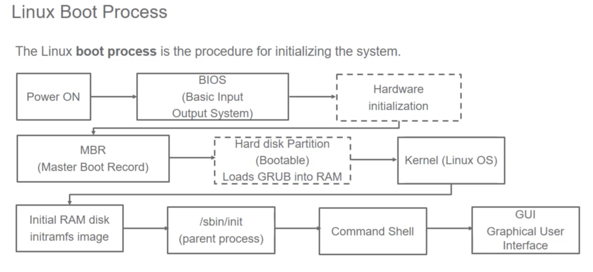
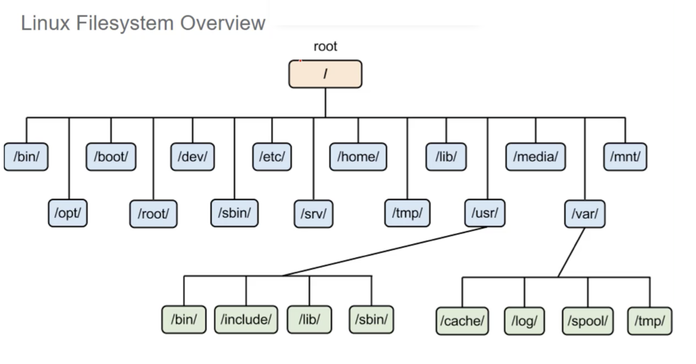

## What is Operating System
To understand what is OS, you need to understand hardware and how programs are ran on hardwares.
Here we use SCM (Single Chip Microcomputer) as an example.
How can multiple programs run on one chip?
Even if we have multiple programs running, how can we stop them intervene each others' memory?
How do we manage files?
What about interrupts?

Now we need something to operate these 'resources', which introduces us into Operating Systems.

### Kernel
To my understanding, kernel is the most essential part of an OS, which includes all necessary functions to "operate" the resources. But this is just a simple and partial description, you can read this.
[What is kernel](https://stackoverflow.com/questions/2013937/what-is-an-os-kernel-how-does-it-differ-from-an-operating-system)


### Shell
After you have a kernel, how would you interact with it? When you want to send commands to the kernel, you have your very OG user interface ---- the shell.
* [What is shell?](http://linuxcommand.org/lc3_lts0010.php)

### Boot Process

Linux startup init services   
Boot loader both in kernel and initial RAM (initramfs) into memory so it can be used directly by the kernel    

### Linux Filesystem Overview

Hierarchy of directories (tree) used to organize files on a compute system
Filesystem Hierarchy Standard (FHS)   
Root directory top of the hierarchy which contains all other directories on the system Multiple drives and/or partitions are mounted as directories in the single filesystem (HDD)   Case-sensitive    
Conventional disk file systems: ext2/3/4, XFS, Btrfs, JFS, NTFS etc.  
Other database: flash etc  


Root directory marks the beginning of the file system:
* /root or / - Contains all the required executables and libraries to boot linux afterwards all other filesystems are mounted on the defined mount points
* /home - all users are placed under
* /bin - directory contains executable binaries used to boot the system and essential command used by all users
* /sbin - intended for essential binaries related to sys admin (fsck and shutdown) * /proc virtual files to view kernel data
* /dev - contains device nodes used by most hardware and software devices (except network)
* /var - contains files that are expected to change in size and content as the system is running (variables)
* /etc - directory is the home for the system config files
* /boot - directory contains the few essentials files needed to boot the system Removable media such as USE drives and CD etc show up as mounted
* /usr - holds most linux programs and datafiles
* /usr/local - holds most linux programs and datafiles unique to installation, mostly those you compile yourself

**/etc, /bin /sbin, /lib, /dev should never be on separate partitions.

### Linux Command Line 
* Sudo: to provide user the admin privileges when required. Allows users to run programs using the security privileges of another user,, generally root (superuser ) 
* Common:
https://maker.pro/linux/tutorial/basic-linux-commands-for-beginners http://www.pixelbeat.org/cmdline.html

**Daemons** - a computer program that runs as a background process, rather than being under the direct control of an interactive user. services constantly run in the background. Example syslogd or sshd  
**Kernel** - Lowest level component between hardware and OS  
**Services** - App or set of apps that runs in the background waiting to be used or carrying out essential tasks.  

### Popular Distros, each has different package managers:
* Debian (Ubuntu, Linux MINT) = Debian Packages
* RedHat (Fedora, Mandriva, Oracle Linux) = RPM Packages Slackware Linux (SUSE)
* Enoch (Chrome OS)
* Arch (Arch Linux)
* Android

### Common files in Linux
Common files that store information for the OS

**cat /etc/passwd**: See all the users in the machine  
**cat /etc/group**: all the groups in the machine. group,password, GID, userlist  
**cat /etc/pam.d/passwd** : password config file.  
**cat /etc/shadow**: Show all the user passwords encrypted.  
**cat /etc/syslog.conf or cat /etc/rsyslog.conf**: Customize the login for the machine cat /etc/fstab : When a machine boots up the machine uses this file to mount the file systems  
**cat /etc/inittab** : don’t edit directly anymore.  
**cat /etc/services**: Port information on whats used and active.  
—  
**/proc** : the proc file system provides information of the hardware and computer such as /proc/scsi has info on SCSI devices etc. **Dont try to modify the files in /proc**
**cat /proc/cpuinfo**: Shows information of each processor  
**cat /proc/meminfo**: Shows information of the memory.  
**cat /proc/swaps** : Shows information of the swapfile  
**cat /proc/interrupts**: Interrupt requests and devices on linux  
**cat /proc/devices**: Shows the devices harddisk, dvd,usb etc hard disk are on sd(n)  
**cat /etc/hosts** : The local dns of the machine  
**cat /proc/version**: Displays the linux version (kernel version)  
**/proc** : Points to pseudo-files that the kernel maintains.  
**cat /etc/securetty** : file holds a list of terminals from which root is permitted to login. **cat /etc/ssh/sshd_config**: File for ssh service configuration
**cat /etc/profile**: system wide profiles environment setup used.

* cat is a file output tool that outputs file contents. 

### Operations
**init** : init program reads the /etc/inittab file that controls the boot process and implements the settings found in that file. Sets the systems initial run level.  
**telinit** : once booted, telinit alter the runlevel. telinit [-t time] runlevel. To change runlevel telinit kills process by sending SIGTERM signal , if that doesnt work it uses SIGKILL

**shutdown [-t sec] [-archcfF] time [warning-message]** : shutdowns the computer and halts it
Log Files: Use to monitor system loads, to check intrusion attempts, to verify the correct functioning of a system. and to note errors generated by certain types of programs.  
**reboot**: reboots the linux machine  
**date** : Will display the current date and time. Can also set time.  
**NTP (Network Time Protocol)** : Ways to distribute the time in sync


**System Info**  
Display all the information for the kernel
```
uname 
uname -a 
uname -m
```

### Package Management
```
pkginfo | more            # shows all the packages on your machine.
pkginfo -l <package name> # detailed information about one particular package etc. pkgadd <package>                 # to add a package to the machine
pkgrm <package>
showrev -p                # show all the patches made on the machine.
showrev -p | grep <keyword>
```

**Different package managers: rpm, yum, dpkg, apt-get**
Find the package in RedHat
```
yum whatprovides libgtk-x11-2.0.so.0
```

### Hardware information
Server Info
Actual Cores Count = Processor Count * CoresCountPerProcessor   
Logical Processor Count = Actual CoresCount * ThreadCount  
